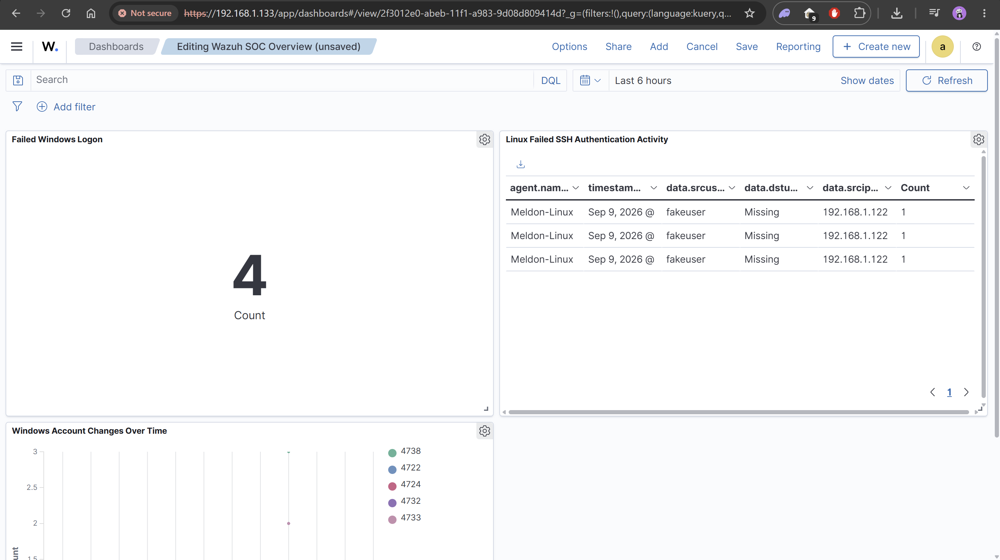
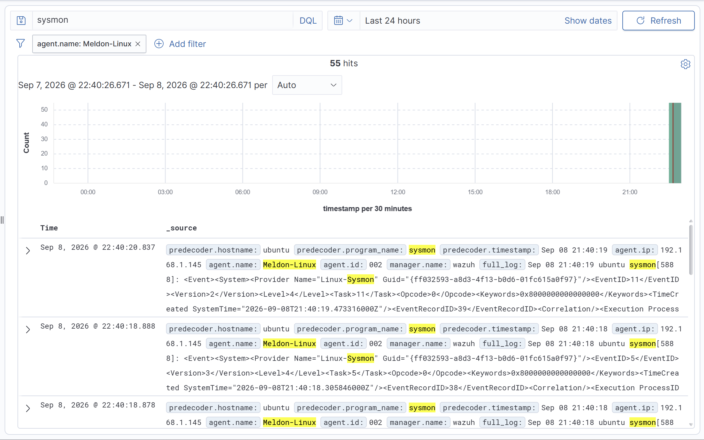
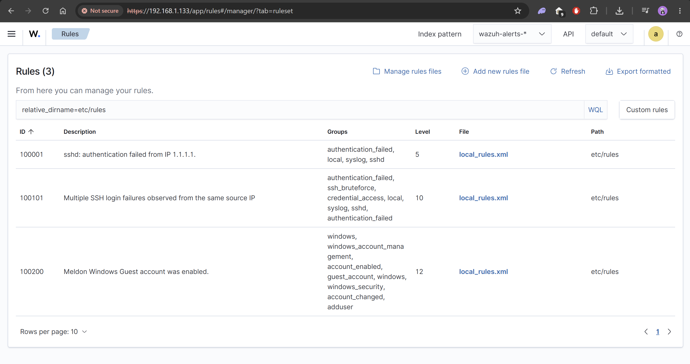
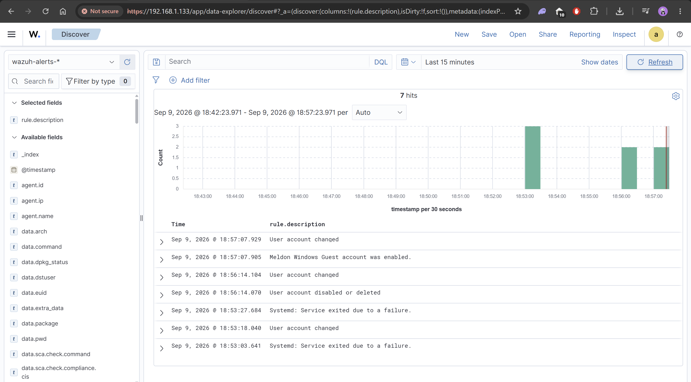
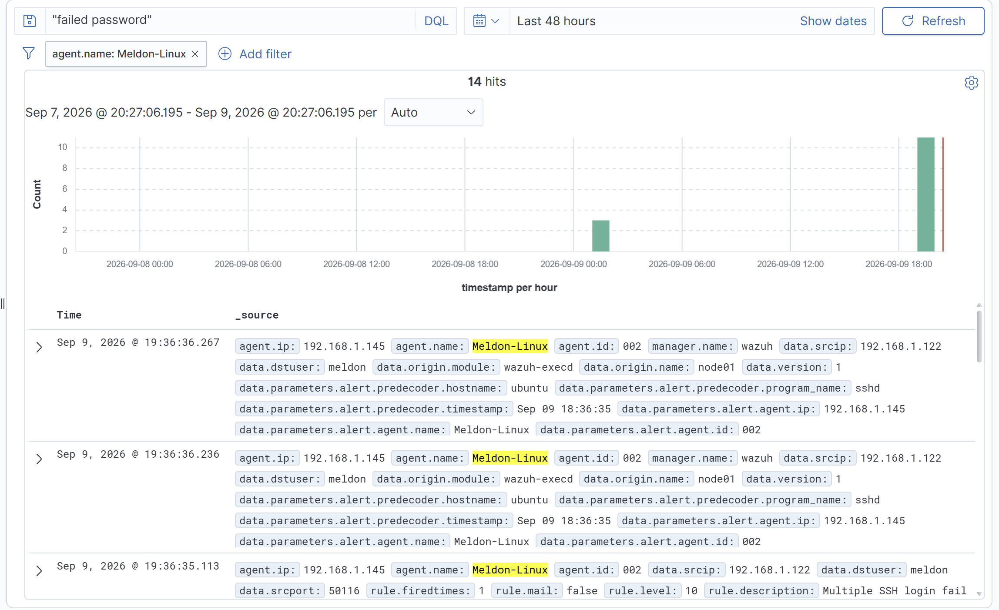
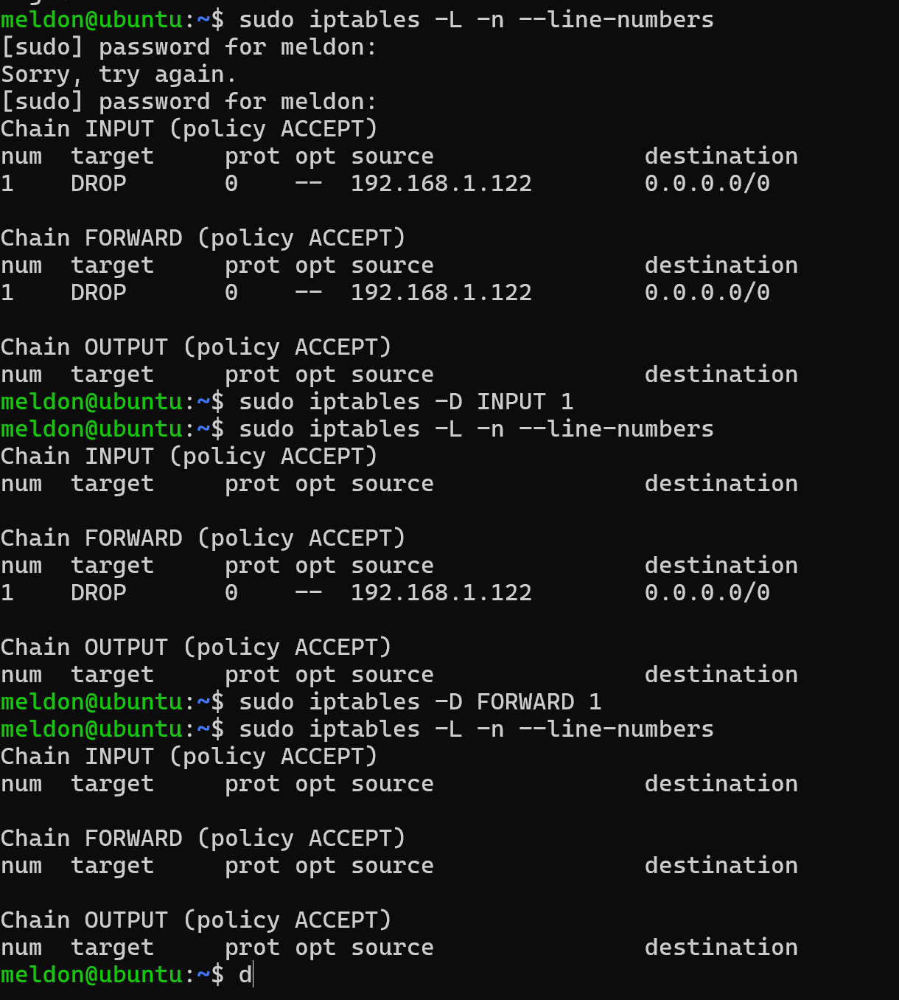
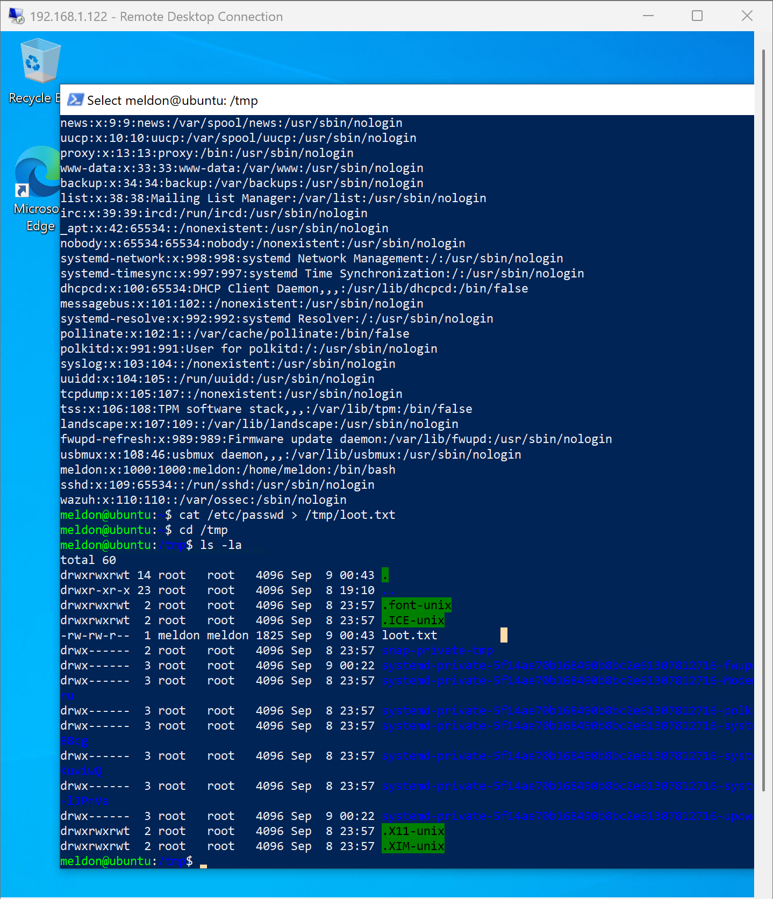

# SIEM-Based Threat Detection & Incident Response Lab | Wazuh, VirtualBox, PowerShell, Bash

A self-built Security Operations Center (SOC) lab demonstrating end-to-end SIEM deployment, custom detection engineering, automated incident response, and formal security investigation — built and documented independently.

---

## Overview

This project simulates a small, realistic corporate environment monitored by a self-hosted **Wazuh** SIEM/XDR platform. It covers the full analyst workflow: deploying a SIEM from scratch, onboarding endpoints across two operating systems, enriching visibility with **Sysmon**, building custom detection rules, configuring automated active response to contain threats, and producing a formal incident investigation report.

The environment was deliberately attacked (by the author, in a controlled and isolated setting) to generate realistic telemetry, then investigated from the analyst's perspective — the same workflow a Tier 1/2 SOC analyst performs on the job.

## Architecture

| Host | Role | OS | Specs | IP |
|---|---|---|---|---|
| Wazuh-Server | SIEM manager, indexer, dashboard | Ubuntu Server 24.04 LTS | 8GB RAM, 2 vCPU, 100GB disk | 192.168.1.133 |
| Windows-Agent | Monitored endpoint | Windows 10 Pro | 4GB RAM, 2 vCPU, 60GB disk | 192.168.1.122 |
| Ubuntu-Agent | Monitored endpoint | Ubuntu Server 24.04 LTS | 2GB RAM, 1 vCPU, 50GB disk | 192.168.1.145 |

All three hosts were built as VirtualBox VMs on a Bridged network, giving each machine a real, directly-addressable IP on the host network rather than an isolated NAT segment — closer to how endpoints are typically reachable in a real environment.

## Build Process

- Deployed the Wazuh all-in-one stack (manager, indexer, dashboard) on Ubuntu Server via the official install script
- Enabled **archives** indexing (`ossec.conf` + `filebeat.yml`) so all telemetry — not just alert-triggering events — is retained and searchable
- Enrolled a Windows 10 and an Ubuntu Server endpoint as Wazuh agents
- Deployed **Sysmon** (Windows, using a community-maintained modular configuration) and **Sysmon for Linux** on both endpoints to significantly deepen visibility beyond native OS logging — capturing process execution, network connections, and file activity that standard event/syslog collection alone would miss

## Detection Engineering

Two custom detection rules were written, tested, and iterated on:

**Rule `100200` (level 12)** — fires when the built-in Windows Guest account (disabled by default) is enabled, a common early indicator of unauthorized account activity or persistence attempts.

**Rule `100101` (level 10)** — fires when three or more failed SSH login attempts are observed from the same source IP within a short window, correlating individual authentication failures (which alone are low-signal) into a single actionable brute-force alert.

Rule development involved genuine debugging — an initial version of the guest-account rule failed to fire due to a field-name mismatch between the syntax used and Wazuh's actual decoded event structure, requiring log inspection and correction before it worked correctly. See [Challenges & Troubleshooting](#challenges--troubleshooting) below.

## Active Response — Automated Containment

Beyond detection, the SSH brute-force rule was wired to Wazuh's **active response** module, automatically executing a `firewall-drop` action against the offending source IP the moment the rule fires — no manual analyst action required.

This was verified end-to-end: a continuous ping was run against the Linux endpoint from the "attacking" host while a brute-force attempt was triggered from a second session. The ping stopped responding within roughly one second of the rule firing, confirming the automated firewall block took effect in real time.

The block was then manually reversed via `iptables -D` to restore connectivity, demonstrating the full detect → contain → recover cycle.

## Investigation Report

Using the telemetry generated across the build, a full incident investigation was conducted and documented following a standard Who/What/When/Where/Why/How format, including a Findings summary, detection coverage mapping, response actions taken, and recommendations.

**➡️ [Read the full investigation report](investigation-report.md)**

Notably, the investigation surfaced a genuine detection gap: a data-staging action (`cat /etc/passwd > /tmp/loot.txt`) could not be located in Wazuh telemetry despite Sysmon being active, because shell-level output redirection is handled by bash itself and isn't visible to process-execution monitoring alone. This is documented as a finding and recommendation in the report rather than glossed over — identifying and honestly reporting detection blind spots is itself a core SOC analyst skill.

## Challenges & Troubleshooting

Real, self-diagnosed issues encountered and resolved during this build:

- **Hypervisor mismatch:** the reference material used VMware Workstation; this lab was built entirely in VirtualBox instead, requiring independent translation of every hypervisor-specific step (VM creation, snapshotting, networking).
- **NAT vs. Bridged networking:** VirtualBox's default NAT mode blocks inbound connections (unlike some VMware NAT configurations), which initially prevented SSH access to the Wazuh server. Diagnosed via connection timeouts and resolved by switching to a Bridged adapter, giving each VM a directly-reachable IP.
- **Silent Windows agent enrollment failure:** the Windows agent showed as "running" but never appeared in the manager's agent list. Diagnosed by inspecting `client.keys` (found empty) and the agent's own logs, then resolved by manually re-running `agent-auth.exe` to complete enrollment.
- **Wazuh manager failing to restart after a host reboot:** diagnosed via `systemctl status` and the dashboard's own API-connection error, resolved by restarting the `wazuh-manager` service and its sub-daemons.
- **Custom rule XML syntax error:** an active-response configuration used the incorrect tag `<rule_id>` instead of the schema-correct `<rules_id>`, causing the manager to fail validation on restart — diagnosed via `journalctl` and corrected.
- **Custom detection rule not firing:** initial rule used `data.win.system.eventID` as the field name, but the actual decoded event used `win.system.eventID` (no `data.` prefix) and required matching existing rule groups (`windows_security`, `account_changed`) to trigger correctly — diagnosed by comparing against Wazuh's built-in rule definitions.

## Skills Demonstrated

- SIEM deployment and administration (Wazuh — manager, indexer, dashboard)
- Endpoint agent deployment across Windows and Linux
- Sysmon configuration for enhanced endpoint telemetry (Windows & Linux)
- Custom detection rule authoring and debugging (Wazuh rule syntax, XML)
- Log analysis and correlation (Windows Security event log, Linux auth logs/syslog)
- Automated incident response configuration (active response, iptables)
- Network administration (VirtualBox networking, bridged adapters, SSH, RDP)
- Formal incident investigation and report writing
- Independent troubleshooting across hypervisor, networking, and SIEM configuration issues

---

*Built as a self-directed learning project. No proprietary or organizational data used — all activity generated in an isolated home lab environment.*
